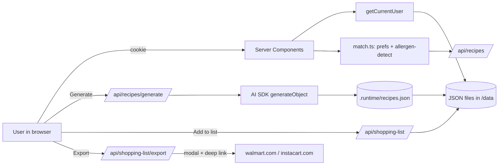

# Mission Pet Recipe App — Build Plan

## Stack

- **Framework:** Next.js 15 (App Router) + React 19 + TypeScript (strict)
- **UI:** Tailwind CSS + shadcn/ui + lucide-react
- **AI:** Vercel AI SDK with `@ai-sdk/openai` (`gpt-4o-mini`) and `generateObject` + Zod
- **Persistence:** JSON files in `data/` read/written by route handlers (one file per entity)
- **Auth:** Mock — a `/login` page with a dropdown of seeded demo users; sets an httpOnly `demo_user_id` cookie; a thin `getCurrentUser()` helper reads it in server code
- **Validation:** Zod for both the LLM output schema and API request bodies

## Domain model

```ts
User       { id, name, householdId }
Household  { id, name, adminUserId, preferences: HouseholdPrefs }
Invite     { token, householdId, createdBy, expiresAt, usedBy? }
HouseholdPrefs { allergies[], diets[], cuisineLikes[], cuisineDislikes[] }
UserPrefs  { userId, allergies[], diets[], cuisineLikes[], cuisineDislikes[] }
Recipe     { id, title, image, cuisine, dietTags[], allergens[],
             ingredients: { name, quantity, unit, category }[],
             steps[], prepMinutes, cookMinutes, servings, createdAt }
ShoppingListItem { userId, recipeId, ingredient, checked }
```

**Preference precedence** (per Q7):
- `effectiveAllergies = union(household.allergies, user.allergies)` — safety-first
- `effectiveDiets` / `effectiveCuisine` = personal overrides household when personal set is non-empty

**Admin semantics** in the single-household-per-user model: `household.adminUserId` is the household creator. Admin can edit `HouseholdPrefs`; every member can edit their own `UserPrefs`.

## Folder structure

```
app/
  (auth)/login/page.tsx              # demo user picker
  (app)/layout.tsx                   # requires cookie, loads user+household
  (app)/recipes/page.tsx             # main grid + filters + sort + generate
  (app)/recipes/[id]/page.tsx        # recipe detail
  (app)/shopping-list/page.tsx       # merged/categorized list + export modals
  (app)/preferences/page.tsx         # personal prefs
  (app)/household/page.tsx           # household prefs (admin-only edit), members, invites
  (app)/invite/[token]/page.tsx      # join flow
  api/
    auth/login/route.ts              # POST { userId } -> sets cookie
    auth/logout/route.ts
    household/route.ts               # GET/PATCH prefs (admin)
    household/invites/route.ts       # POST create token
    invites/[token]/accept/route.ts  # POST -> add user to household
    preferences/route.ts             # GET/PATCH personal prefs
    recipes/route.ts                 # GET list (reads cache + applies filters/sort on server)
    recipes/generate/route.ts        # POST -> streamObject, appends to cache
    shopping-list/route.ts           # GET/POST add items, PATCH check, DELETE
    shopping-list/export/route.ts    # POST { vendor } -> returns formatted payload + deep link
components/
  recipe-card.tsx, recipe-grid.tsx, warning-badge.tsx, preference-form.tsx,
  filter-bar.tsx, shopping-list-table.tsx, export-modal.tsx, ui/* (shadcn)
lib/
  store/                             # JSON file repos: users.ts, households.ts,
                                     # invites.ts, recipes.ts, shopping-list.ts
  auth.ts                            # getCurrentUser, requireUser, requireAdmin
  preferences.ts                     # effective-prefs merge
  allergen-detect.ts                 # keyword scan over ingredients
  match.ts                           # recipe <-> prefs scoring + warnings
  ai/
    recipe-schema.ts                 # Zod schema for generated recipes
    generate-recipe.ts               # generateObject wrapper w/ cache lookup
data/
  seed/users.json, households.json, recipes.json   # checked in
  .runtime/*.json                                  # gitignored, mutable
```

## Key flows

**Login:** `/login` lists seeded users (Alice — admin of Smith Family, Bob — member, Carol — admin of Lee Household). Clicking sets cookie via `/api/auth/login`.

**Invite:** On `/household`, admin clicks "Invite" → `POST /api/household/invites` returns a token → UI shows link `/invite/<token>` in a toast with a copy button (no email per Q5). Visiting the link as a logged-in user calls accept and moves them into the household. Visiting while logged out routes to `/login?next=/invite/<token>`.

**Preferences (Q6, Q7):** Multi-select chips for the three categories on `/preferences` (personal) and `/household` (shared). `lib/preferences.ts` computes the effective set per the rule above.

**Recipes:**
- `recipes.json` ships with ~20 hand-seeded recipes (so the demo works offline out of the box).
- `POST /api/recipes/generate` uses `generateObject({ model: openai('gpt-4o-mini'), schema: RecipeSchema })` with a prompt that biases toward the user's likes/restrictions but still allows "dangerous" recipes so warnings surface. New recipes append to `data/.runtime/recipes.json` with a cache key of `{cuisine, diet, seed}` to avoid hitting the API on refresh (Q9).
- `RecipeSchema` (Zod) requires `allergens[]`, `diets[]`, `cuisine`, `ingredients[]`. `lib/allergen-detect.ts` ALSO scans each ingredient name against an allergen keyword map; `lib/match.ts` unions both sources into `recipe.flaggedAllergens` (Q10 belt-and-suspenders).
- `GET /api/recipes` accepts `?cuisine&maxPrep&diets&sort&hideAllergyWarnings` and returns recipes pre-annotated with `{ matchScore, warnings: { allergy: [...], diet: [...] } }` for the current user.

**Recipe grid (Q11, Q12):**
- Card: image, title, cuisine chip, prep time, badges: red "Contains: peanuts" / amber "Not vegetarian" / green "Matches your prefs".
- `FilterBar`: cuisine multi-select chips, max prep time slider, diet chips, sort dropdown (Best match / Prep time / Newest / A–Z), "Hide allergy warnings" toggle. URL-synced via `nuqs` so refresh preserves state.
- "Generate new recipe" button streams into the grid using `streamObject`.

**Shopping list (Q13, Q14):**
- Per-recipe "Add to shopping list" button → `POST /api/shopping-list` adds each ingredient.
- `/shopping-list` merges duplicates by normalized name + unit (`2 tbsp olive oil + 1 tbsp olive oil → 3 tbsp`), groups by `ingredient.category` (the LLM/seed provides it: Produce, Dairy, Pantry, Meat, Other), supports check-off.
- Export buttons open `<ExportModal vendor="walmart" | "instacart" />`: shows formatted preview of the items, then "Open Walmart" / "Open Instacart" opens `https://www.walmart.com/cart` or `https://www.instacart.com/store` in a new tab (pure deep link, no cart population — this is the honest mock).

## Data flow



## Config & env

- `OPENAI_API_KEY` in `.env.local` (optional — if missing, `/api/recipes/generate` falls back to picking a random seed recipe and labels it "mock").
- `NEXT_PUBLIC_APP_NAME` for header.
- `.gitignore`: `data/.runtime/`, `.env.local`.
- Single `package.json`, single `pnpm dev`.

## Out of scope for this pass

- Real auth, real email, real partner APIs, meal planning, nutrition macros, recipe images beyond placeholder URLs, tests beyond a couple of smoke tests on `lib/match.ts` and `lib/preferences.ts`.